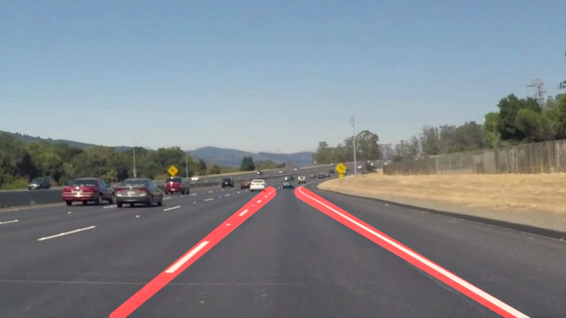
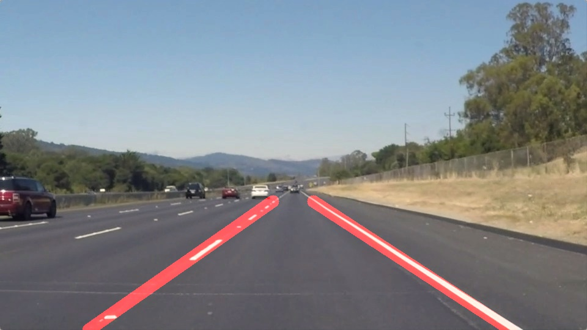

# **Finding Lane Lines on the Road** 

**Author: Shachar Mendelowitz**

- [**Finding Lane Lines on the Road**](#finding-lane-lines-on-the-road)
- [**Finding Lane Lines on the Road**](#finding-lane-lines-on-the-road)
    - [**Project required files**](#project-required-files)
        - [Test images with annotations](#test-images-with-annotations)
- [**Project strategy**](#project-strategy)
- [**Reflection**](#reflection)
        - [**1. Describe your pipeline. As part of the description, explain how you modified the draw_lines() function.**](#1-describe-your-pipeline-as-part-of-the-description-explain-how-you-modified-the-drawlines-function)
        - [***2. Identification of potential shortcomings with current pipeline***](#2-identification-of-potential-shortcomings-with-current-pipeline)
        - [***3. Possible improvements to your pipeline***](#3-possible-improvements-to-your-pipeline)

# **Finding Lane Lines on the Road**

The goals / steps of this project are the following:
* Make a pipeline that finds lane lines on the road
* Reflect on your work in a written report

[//]: # (Image References)

[image1]: ./examples/grayscale.jpg "Grayscale"

[//]: # (Image References)

[cielab]: images/CIELAB.png

---

## **Project required files**

* notebook with code
* markdown report
* output files 

        test_videos_output/solidWhiteRight.mp4
        test_videos_output/solidYellowLeft.mp4
        test_videos_output/challenge.mp4

### Test images with annotations

| solid white curve                    | solid white right                    |
| :----------------------------------: | :----------------------------------: |
|  |  |

| solid yellow curve                    | solid yellow curve                     |
| :-----------------------------------: | :------------------------------------: |
|  |  |

| solid yellow left                    | white car lane switch                   |
| :----------------------------------: | :-------------------------------------: |
|  |  |

# **Project strategy**

**1. Soft cost function** - cost function cosist of a combination of rough expected lanes location X & Y axes, angle and more. We want to "punish" lines that are flat 0 deg, or are too high in the picture

**2. domain knowledge** - for hard stop. Use ROI (region of interest) will make sure that (high confidence) irrelevant locations are masked out

**3. Road lanes** - lanes come in yellow/white - Use CIELab color space. Use native perceptive CIELab colorspace - L,b channels. 

        L - luminance - axis
        a - greed-red axis
        b - blue-yellow axis

L,b channels are used to mask white & yellow patches, while the a channel is irrelevant

![alt text][cielab]

**4. Road lanes detection** - as anomaly. Look for the 95% percentile of Luminance and b-channel yellow markings in the picture. Thus, no need for absolute values, only the 5% as outliers assumption.

# **Reflection**

### **1. Describe your pipeline. As part of the description, explain how you modified the draw_lines() function.**

The pipeline can be broken down to 11 separated steps. There are several extra preprocessing steps added in order to increase robustness to the input image, focusing on outliers filtering image-adaptive calculations, lowering fixed-thresholds dependencies as much as possible. 

The pipeline cosists of the following steps:

1. White balance - initial illuminiation is unknown and white balance tries limiting the dynamic range of input illuminations. Gray world assumption assumes a balanced light source. The basic assumption in current project is sun light, a balanced source light. The gray-world white balance algorithm has been rewritten according to [GIMP Automatic white balance](https://pippin.gimp.org/image-processing/chapter-automaticadjustments.html)

2. CIELab color space

    working in the native colorspace of our target detection target allows simpler means of detection. 

    It can be seen the L channel is similar to a grayscale image,without color knowledge coded into it. the b channel highlights the yellow parts. Finally, as expected, the a channel contains no relevant information for neigther yellow or white lanes.

| **Original**                             | **L channel** (black-white axis) |
| :----------------------------------:     | :------------------------:       |
|      |        |

| **a channel** (red-green axis)           | **b channel** (blue-yellow axis) |
| :---:                                    | :---:                            |
|                |        |

3. CIELab 95% thresholding 
    
    Threshold the L + b and add them to create a signel relevant mask image. 

| L mask                  | b mask                  | Joint                    |
| :---------------------: | :---------------------: | :----------------------: |
|  |  |  |

4. Gaussian blur - prior to Canny 
6. Adaptive Canny - low/high thresholds as 25%/75% image percentile
7. Apply ROI - the region of interest is a trapezoid between lower most part of the image (max Y)

8. Retrieve Hough lines

    
    allowing max_line_gap is large, since it is require to join the defragment lane section as well.

9.  Cost function 

    Calculate for left & right lanes, a score function for every line, based on angle (closest to 45), line around 40/60% of the width, proximity to lower part of the image

10.  Outlier filtering

     calculate for left & right lanes the angle and intersection and filter out outliers (outside the standard deviation).

11.  Estimate lanes

     From the inliers, evaluate the line - from the bottom of the image up to the highest detected point. 
     Finally Evaluate and estimate Left & Right lanes.

    
In order to draw a single line on the left and right lanes, I modified the draw_lines() function by spliting to a positive & negative lines (all inliers, post outlier filtering) and extrapolating from the bottom of the image up to the highest point detected. The width is constant, after evaluating the width as the std of the (rotated) points has yielded "jumpy" results.

**Challenge video**

The challenge video presented a few challenges:

1. the vehicle's front is showing - a source for many outliers
2. changing road color, can be seen two different colors and two boundaries, both of which has caused outlier hough lines
3. shadows - different illumination has caused multiple outlier lines as well

Working in the native CIELab colorspace and treating lanes as road outliers has increase robustness to these illumination based noise.

### ***2. Identification of potential shortcomings with current pipeline*** 

One potential shortcoming would be what would happen when the vehicle might change lanes, as it gives preference to lanes in the 40%/60% width of the image.

Another shortcoming could be that straight lines work well for long straight drives, but not as well for a lot of types of roads which are curved.

A second shortcoming is the uniform illumination assumption. While in both test videos the lighting with high SNR and uniform, the challenge video shows different illuminations originating from both alternating road colors and shadows induced by trees, which could have been caused by other vehicles as well. 

Another shortcoming that has not been dealt with are occlusions - the passing of another vehicle, sun bliding from water on the road, or anything that will hide the lane. 

### ***3. Possible improvements to your pipeline***

A possible improvement would be to allow for time dependency estimation - for example, usage of a kalman filter for evaulating the location of the lanes between frames. This will increase lane search speed (as the search area is substantially smaller), increase outlier robustness and overall accuracy.

Another potential improvement could be to change lane representation from a straight line to a polynomial or any a-parametric representation, as curves are compeletely disregarded in the current pipeline.

Shadows specifically can be preprocessed and revmoed, as shown in [An Efficient and Robust Moving Shadow Removal Algorithm and Its Applications in ITS](https://asp-eurasipjournals.springeropen.com/articles/10.1155/2010/945130), [Shadow Removal from a Single Image](http://lxu.me/mypapers/XuL_ShadowRemoval.pdf), or any of the variety listed in [Study of Different Shadow Detection and Removal Algorithm](https://pdfs.semanticscholar.org/5fef/1b8c6655a6dcdd66684aaa9f101b726090cb.pdf)

